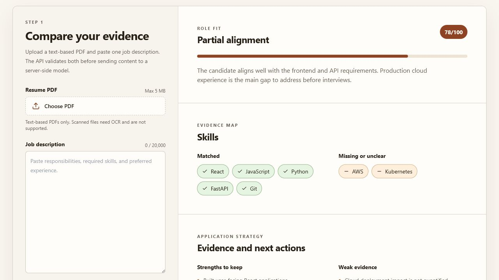

# AI Resume Matcher

Compare a PDF resume with a job description and receive a deterministic, validated match report with fit score, evidence, skill gaps, recommended actions, learning priorities, interview questions, and neutral risk flags.

**Live demo:** https://ai-resume-matcher-psi-one.vercel.app
**Health:** https://ai-resume-matcher-psi-one.vercel.app/api/health



## Product flow

```text
PDF resume + job description
  -> React validation and upload
  -> FastAPI /api/analyze
  -> PDF text extraction and limits
  -> deterministic local matching
  -> strict schema validation
  -> score, evidence, gaps, actions, interview prep
  -> safe React report rendering
```

## Highlights

- Validates PDF extension, MIME type, file size, extractable text, and job-description length.
- Uses deterministic local matching with no external inference account or credential required.
- Produces stable reports from explicit skill evidence in the supplied texts.
- Supports sample mode for reviewer-friendly demonstrations.
- Caches repeated analyses in process with a configurable TTL.
- Uses one FastAPI app for local development and Vercel.
- Includes unit, integration, API, schema, build, and browser test tooling.

## Tech stack

| Layer | Technology |
| --- | --- |
| Frontend | React 18, Vite 8, Tailwind CSS, Lucide |
| Backend | Python 3.12, FastAPI, Pydantic v2 |
| PDF | pypdf |
| Analysis | Deterministic evidence and skill-gap matching |
| Testing | pytest, Vitest, Testing Library, Playwright |
| Deployment | Vercel |

## Local setup

```powershell
git clone https://github.com/Praciller/ai-resume-matcher.git
cd ai-resume-matcher
python -m venv backend/.venv
backend/.venv/Scripts/python.exe -m pip install -r backend/requirements-dev.txt
backend/.venv/Scripts/python.exe -m uvicorn backend.main:app --reload --port 8000
```

Frontend:

```powershell
cd frontend
npm ci
npm run dev
```

Open `http://localhost:5173`. Vite proxies `/api` to `http://127.0.0.1:8000`.

Generate deterministic evidence from synthetic fixtures:

```powershell
$env:PYTHONPATH="."
backend/.venv/Scripts/python.exe scripts/generate_local_match_report.py
Get-Content reports/local_match_report.md
```

No real resumes or bulk resume datasets are tracked. Reviewer fixtures are synthetic; optional local datasets belong under the ignored `backend/dataset/resumes/` directory.

## Environment

The public environment contract contains only application limits, allowed frontend origins, and cache settings. No external inference credential is required.

See [.env.example](.env.example).

## API

### `GET /api/health`

Returns local mode and input limits without external calls.

### `POST /api/analyze`

Multipart fields:

- `resume_file`: PDF
- `job_description`: job-description text

The response follows the strict schema documented in [docs/api.md](docs/api.md), including score, matched and missing skills, recommendations, learning plan, interview questions, warnings, and an analysis identifier.

### `POST /api/mock-analyze`

Returns a deterministic sample report without a resume upload.

## Matching method

The matcher extracts a bounded set of explicit skill terms from the job description, checks whether those terms occur in the resume, computes a reproducible coverage-based score, and generates recommendations for missing evidence. It does not infer hidden experience or make hiring decisions.

## Safety and scope

- This is a portfolio decision-support demo, not an automated hiring authority.
- Synthetic samples are the default reviewer inputs.
- The score is a deterministic portfolio heuristic, not calibrated to hiring outcomes.
- The project has not been fairness or compliance audited.
- Do not upload sensitive resumes to a public deployment.
- Results support human review only and must not determine candidate selection.

## Testing

```powershell
backend/.venv/Scripts/python.exe -m pytest -q backend/tests
backend/.venv/Scripts/python.exe -m ruff check backend scripts
backend/.venv/Scripts/python.exe scripts/check_repo_guardrails.py

cd frontend
npm run test:unit
npm run test:integration
npm run test:e2e
npm run build
npm audit --audit-level=high
```

See [docs/testing.md](docs/testing.md) and [docs/verification.md](docs/verification.md).

## Known limitations

- No OCR for scanned or image-only PDFs.
- Cache is process-local and can reset between serverless instances.
- The score is based on bounded explicit skill matching and misses synonyms, proficiency, recency, and transferable skills.
- The result is not a predictor of interview or hiring outcomes.

## Documentation

- [Architecture](docs/architecture.md)
- [API](docs/api.md)
- [Testing](docs/testing.md)
- [Verification](docs/verification.md)
- [Portfolio review](PORTFOLIO_REVIEW.md)
- [Local review](docs/local_review.md)
- [Portfolio reviewer flow](docs/portfolio_review.md)
- [Matching methodology](docs/matching_methodology.md)

## License

MIT
